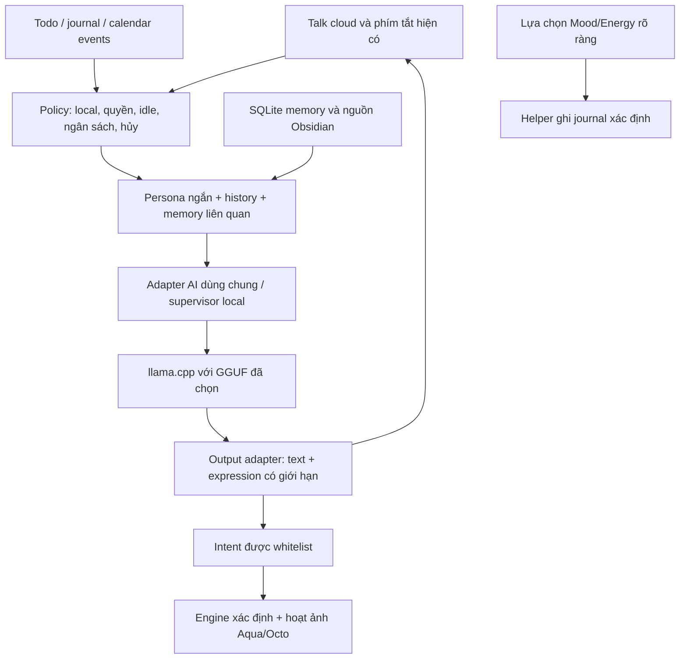

# Tham khảo mak1zu cho Local LLM của Hadalis Companion

Ngày nghiên cứu: **2026-10-08** (Asia/Ho_Chi_Minh).

**Phạm vi: nghiên cứu mã nguồn và ghi chú; chưa triển khai.** Mục tiêu là hội thoại cục bộ cho Aqua/Octo trên desktop, không tích hợp Discord. Các hướng dưới đây là đề xuất để đánh giá, chưa phải quyết định kiến trúc hay công việc đã được duyệt. [Wull Local AI](../to-do/cloud-bot/WULL_LOCAL_AI.md) vẫn là nơi duy nhất quản lý kế hoạch và trạng thái AI; tài liệu này là nguồn tham khảo kỹ thuật theo yêu cầu của maintainer.

| Nguồn được đọc | Revision |
| --- | --- |
| [snowarch/mak1zu](https://github.com/snowarch/mak1zu/tree/a30fef7cc10324684fd4ae9123d9c29cbd00ca9e) | `a30fef7cc10324684fd4ae9123d9c29cbd00ca9e` |
| Hadalis `dev` tại lúc đối chiếu | `8eba344f29da249844fbe8910f0a8abf00c859c0` |

Đã đọc README, kiến trúc, provider/discovery, persona, memory/ledger, turn pipeline, presence, night reflection, output guard, voice evaluation, persona distillation và các test liên quan. Với Hadalis, đã đọc kế hoạch AI và đường đi hiện tại qua `WullMind`, `AiTextSession`, `Ai`, GGUF supervisor, history store và helper Obsidian. Không chạy mak1zu, cài dependency, gọi model, quét các server đang chạy hoặc đọc vault/lịch sử cá nhân. Các test của upstream chỉ được đọc, chưa được chạy và không được coi là PASS trong nghiên cứu này.

## Kết luận chính

**Hadalis nên học cách tổ chức hội thoại của mak1zu, giữ renderer và backend hiện có.** Giá trị lớn nhất là trí nhớ có nguồn gốc, persona có thể kiểm chứng, chính sách chủ động biết giảm làm phiền và ngân sách suy luận. mak1zu là engine dùng model, không phải model mới hoặc công cụ huấn luyện local LLM. Nó có transport local riêng và provider tương thích API, nên nhiều ý tưởng không phụ thuộc Discord. [Architecture][M1], [SDK][M2]

Không có bằng chứng từ lượt đọc này rằng dùng engine Go, một binary hoặc thêm một persona sẽ làm inference nhanh hơn hay ít RAM hơn. Chi phí trọng số, context, KV/state cache, nạp model và GPU offload vẫn phải đo trong P1 của Hadalis. Chưa có lý do để thay `llama.cpp`, đổi model đang chọn hoặc thêm daemon mak1zu vào desktop.

## 1. Hadalis đã có gì, và khoảng trống thực sự nằm ở đâu?

Những nhận xét dưới đây dựa vào source Hadalis ở revision đã ghi, không dùng phần “installed source” ngày 2026-10-04 trong kế hoạch như bằng chứng cho runtime hôm nay.

| Hạng mục | Hiện trạng thấy trong source Hadalis | Phần đáng học thêm |
| --- | --- | --- |
| Gọi AI | `WullMind.sendMessage()` dùng session riêng của service `Ai`; chọn model Companion hoặc model của tab AI. | Giữ một catalog/backend dùng chung; bổ sung chính sách local rõ ràng cho Companion. |
| Giọng Aqua/Octo | Instruction chọn droplet/octopus, yêu cầu câu tiếng Anh ngắn và expression trong danh sách cho phép. | Persona riêng, ví dụ hội thoại riêng và đánh giá khả năng giữ giọng qua nhiều lượt. |
| Lịch sử | SQLite lưu lượt user/assistant và model; phân trang, giới hạn 2.000 hàng, có chức năng xóa. Schema hiện tại không có character/persona scope. | Phân biệt lịch sử với trí nhớ dài hạn; phân tách kỷ niệm riêng của Aqua/Octo và sở thích dùng chung được người dùng cho phép. |
| Obsidian | Helper đọc dữ liệu journal/schedule; lựa chọn Mood/Energy ghi qua đường đi xác định và có kiểm tra. | Retrieval có nguồn, ngày và hiệu lực; không biến suy đoán của model thành trạng thái journal. |
| Nhắc lịch/chủ động | Có nhắc Todo/calendar/journal, các mức tần suất, gate idle cho check-in/lời vui và nội dung built-in. | Backoff khi bị bỏ qua, quiet hours và giải thích vì sao một lời nhắc bị hoãn. |
| Hủy và giới hạn | Session có serial, cancellation, deadline; GGUF có khóa dùng chung, một slot và cleanup process group. | Ngân sách tổng cho mọi lời gọi phụ như sửa câu, truy hồi/summary và extraction. |
| Hành động | Session Companion loại tool definitions và từ chối function call; expression được whitelist. | Giữ nguyên ranh giới này; nếu phát triển agent thì dùng typed tools được cấp quyền riêng, không diễn giải prose thành lệnh. |

Nguồn đối chiếu: [WullMind](../services/WullMind.qml), [AiTextSession](../services/ai/AiTextSession.qml), [Ai](../services/Ai.qml), [history store](../scripts/wull/history_store.py), [Obsidian/helper](../scripts/wull/local_mind.py), [GGUF supervisor](../scripts/wull/gguf_runtime.py).

**Chi tiết quan trọng về local:** `Ai.modelCanRun()` đã chặn model không local khi AI privacy policy bằng `2`. Tuy nhiên, `WullMind` dùng catalog/session nhiều provider; ngoài policy đó, một model cloud hợp lệ cũng có thể được chọn. Đây không phải bằng chứng dữ liệu của maintainer đã rời máy. Nó cho thấy không thể suy ra “Companion luôn local” chỉ từ sự tồn tại của helper GGUF hoặc helper Ollama cũ. Chế độ local trong thiết kế sau này cần được kiểm tra tại chính đường request đang dùng.

## 2. Những ý tưởng nên chuyển sang thiết kế Hadalis

### 2.1 Tính cách là một lớp nhỏ, tách khỏi quyền hành động

mak1zu tách persona Markdown, quy tắc chung và ngữ cảnh từng lượt; phần compose nhận memory, thời gian và mood riêng. Cách tổ chức này giúp thay giọng mà không thay transport/model. [Persona composer][M3]

Với Hadalis, có thể đánh giá hai persona ngắn: Aqua ấm áp, hay chơi chữ về nước; Octo tò mò, tự tin, hài hước về xúc tu. Cả hai dùng tiếng Anh trong talk cloud, trả lời ngắn và không bịa việc đã làm. Thái độ tranh nhau xuất hiện chỉ là màu sắc hội thoại; việc ai xuất hiện, động tác kéo xuống nước và thời điểm đổi nhân vật vẫn thuộc engine xác định.

Phải tách **mood của Companion** khỏi **Mood/Energy người dùng đã chọn**. State nội bộ có thể đổi giọng/biểu cảm và trở về baseline theo thời gian; không được tự điền cảm xúc của người dùng vào journal. Heuristic từ khóa mood của mak1zu chỉ là một ví dụ đơn giản, không phải phương pháp nhận biết cảm xúc đáng tin cậy. [Mood state][M4]

Ví dụ giọng do tài liệu này đề xuất, không lấy từ chat thật:

| Tình huống | Aqua | Octo |
| --- | --- | --- |
| Người dùng vừa hoàn thành cardio | “You ran. I supervised the puddle. Excellent teamwork.” | “Workout complete? All four arms approve.” |
| Không tìm được lịch hôm nay | “My little calendar is empty. I won't invent a splash appointment.” | “No schedule found. My tentacles refuse to guess.” |

### 2.2 Trí nhớ dài hạn có provenance và quyền xóa

mak1zu có SQLite/FTS5, tách episodic/semantic/introspective memory, lưu nguồn và truy hồi theo người/persona; embedding rerank là tùy chọn. Nó còn có API quên một mục hoặc xóa các dữ liệu theo người. [Memory store][M5]

Hadalis đã có SQLite cho history, vì vậy không cần giới thiệu một database/vector daemon mới chỉ để nhớ sở thích. Có thể đánh giá một kho memory nhỏ dùng SQLite/FTS trước, với các trường như loại, scope, nội dung, nguồn, thời điểm, ngày hết hạn và trạng thái được người dùng xác nhận. Chỉ lấy vài mục liên quan cho mỗi lượt; thêm embedding chỉ khi truy hồi từ khóa thất bại trong bộ câu hỏi thực tế.

Các nguyên tắc thiết kế nên đánh giá:

- Sở thích được xác nhận có thể dùng chung cho Aqua/Octo; kỷ niệm hoặc running joke riêng có character scope.
- Todo, agenda, cardio/calisthenics lấy từ dữ liệu gốc hiện hành. Memory không thay thế vault hay tạo một lịch thứ hai.
- Khi có mâu thuẫn, giữ nguồn/ngày và hỏi khi cần; không để summary cũ ghi đè giá trị journal mới.
- Có cách xem, xóa từng memory và tắt lưu dài hạn. Xóa chat và quên dữ liệu suy ra từ chat là hai phạm vi khác nhau, cần diễn đạt rõ.
- Auto-extraction chỉ tạo đề xuất có nguồn; lời của model không tự trở thành fact. Ban đầu ưu tiên yêu cầu rõ như “remember this”. Không lưu mọi câu người dùng nói.

### 2.3 Open threads và running jokes có thời gian nghỉ

Ledger của mak1zu tách những việc còn dang dở và những câu đùa dùng lại; có trạng thái đóng, giới hạn mục và cooldown cho callback. Đây là cơ chế tạo cảm giác nhớ chuyện trước mà không lặp một câu mở đầu mãi. [Memory ledger][M6]

Ứng dụng hợp lý là nhớ một mục người dùng đã chủ động nói với Companion, hoặc tham chiếu một task Obsidian bằng ID/nguồn. Trạng thái hoàn thành task vẫn do Todo/vault xác định. Nếu người dùng bỏ qua một callback, giảm sử dụng nó. Tránh biến hội thoại thành chuỗi hỏi Mood/Energy liên tục.

### 2.4 Chính sách chủ động nằm ngoài model

Presence của mak1zu kiểm tra quiet hours, lần trò chuyện gần nhất và số lời chủ động không được trả lời; khoảng cách giữa các lời tăng lên và có điểm dừng. Gate có hàm thuần để kiểm tra riêng. [Presence policy][M7]

Hadalis có thể học **backoff và gate xác định**, thay vì gọi LLM để quyết định mỗi vài giây xem có nên nói. Tôn trọng mode Manual, idle, fullscreen/game/DND, cuộc chat đang mở và việc người dùng đã dismiss. Nhắc lịch đến hạn và câu đùa ngẫu nhiên cần độ ưu tiên khác nhau; dồn nhiều event thành một lời nhắc có giới hạn thay vì mở nhiều cloud.

Không bê nguyên các khoảng thời gian thiết kế cho chat Discord sang desktop. Tần suất hiện tại là preference của người dùng; thay đổi sau này phải được đánh giá trong ngữ cảnh desktop và không tự bật inference nền liên tục.

### 2.5 Đánh giá “dễ thương” bằng mẫu hội thoại

`voice` của mak1zu đo độ dài, opener/phrase lặp, tỷ lệ kết thúc bằng câu hỏi và dấu hiệu giọng customer-support; `Check()` so với target. [Voice metrics][M8]

Có thể bổ sung bộ đánh giá riêng cho Aqua/Octo: câu vui, nhắc lịch, an ủi ngắn, phản ứng bị trêu, không có model, không có journal, đổi nhân vật giữa request và hội thoại nhiều lượt. Đánh giá cả schema, đúng dữ kiện, khác biệt hai giọng, mức làm phiền và những lời hứa chưa có hành động xác nhận. Không đánh giá bằng độ dài/emoji đơn thuần; các câu hỏi Mood/Energy có chủ đích không nên bị tính là lỗi giọng chung.

Với output sai style, ưu tiên fallback có sẵn hoặc xử lý nhẹ. Sửa câu bằng thêm một inference chỉ nên nằm trong ngân sách được đo; không bật một lần regenerate cho mọi câu ngắn theo mặc định.

### 2.6 Provider adapter, diagnosis và circuit breaker

mak1zu tách provider khỏi engine; router có danh sách theo capability và cooldown sau lỗi. Discovery dùng `/v1/models` trên một danh sách loopback port hữu hạn; probe kiểm tra khả năng trả lời. [Provider router][M9], [Local discovery][M10]

Hadalis đã có GGUF discovery và catalog AI. Phần đáng bổ sung là chẩn đoán rõ: artifact có nhưng thiếu runtime, model đang bận, nạp thất bại, timeout, response/schema không hợp lệ. File được tìm thấy, endpoint liệt kê được và một request thật thành công là ba mức khác nhau. Health probe cần do người dùng yêu cầu hoặc gắn với request thật, không đánh thức model mỗi lần hover/appearance.

Trong chế độ local, fallback chỉ được chọn backend local đã cấu hình hoặc lời built-in. Không sao chép ordered fallback có thể đi sang provider cloud. Loopback cũng có thể là gateway proxy; backend identity và redirect/proxy policy cần được kiểm tra, không chỉ tên host hay tên model.

### 2.7 Một ranh giới output chung và sự kiện dễ giải thích

Guard của mak1zu lọc protocol/thought/envelope và phát hiện một số kiểu lặp; pipeline ghi lỗi, provider/model, số vòng và thông tin ngữ cảnh đã dùng. [Output guard][M11], [Turn pipeline][M12]

Có thể học mô hình một output adapter cho text + expression: kiểm tra schema/kích thước, loại internal protocol, giữ dữ kiện và từ chối lời tuyên bố đã thực hiện một tool chưa có receipt. Mọi nhánh chat, lỗi, fallback và nhắc lịch phải đi qua cùng hợp đồng. Regex hay nhãn “data, not instructions” là hỗ trợ, không phải ranh giới cấp quyền chống prompt injection.

Thông tin chẩn đoán nên là model ID, request ID, thời gian, số token/memory được dùng và lý do im lặng; không mặc định lưu raw prompt, journal, screenshot hoặc câu chuyện cá nhân vào debug log. Có thể đặt chẩn đoán trong Settings sẵn có, không cần một web panel mới.

## 3. Kiến trúc local phù hợp để đánh giá

Sơ đồ dưới đây là **mô hình tham khảo đề xuất**, không mô tả một Rust AI agent đã hoàn thành:

Ranh giới cần giữ khi đánh giá:

1. Một catalog và một bộ quản lý request/model; không tạo hai tiến trình inference tranh tài nguyên cho AI tab và Companion.
2. Một người dùng local trước; không cần guild/channel/account linking của Discord. Identity/scope không do model tự chọn.
3. Model chỉ sinh text và đề xuất semantic state. Render, di chuyển, peek, curiosity và chuyển Aqua/Octo tiếp tục chạy khi inference lỗi hoặc tắt.
4. Hủy, đổi nhân vật/model hoặc đổi context phải chặn reply/memory đề xuất cũ. Đổi nhân vật không cần nạp lại trọng số nếu backend/model giữ nguyên.
5. Vault/tool output/memory là dữ liệu không đáng tin; tool executor và journal writer không nhận shell command/path tùy ý từ text.
6. Người dùng vẫn chọn Mood/Energy qua nút riêng; local memory không tạo một đường ghi journal từ prose AI.

Không quyết định ở đây nên dùng một hay hai model, warm TTL hay native Rust supervisor. Các câu hỏi đó đã thuộc P1 trong kế hoạch chính, cần đo trên máy đích trước khi thay baseline.

## 4. Ngân sách cho model nhỏ: cần học nguyên tắc, không sao chép con số

Test budget của mak1zu đặt trần **7.600 byte tool schemas** và **12.200 byte persona + substrate**; đây là trần byte cho hai phần, không phải tổng token của một lượt. [Prompt budget tests][M13]

GGUF supervisor Hadalis đang đặt context **2.048**, một slot, CPU tối đa bốn thread và tắt GPU offload trong baseline được đọc. Nó giữ tối đa hai system message, sáu message gần nhất và cap ký tự; các mức effort còn có output/thinking budget khác nhau. Giới hạn ký tự không chứng minh prompt sẽ vừa context của mọi tokenizer.

Vì vậy không nên đưa nguyên persona/substrate/tool catalog của mak1zu vào model hiện tại. Một thiết kế phù hợp cần:

- Tokenize bằng tokenizer đúng của model để tính persona, history, retrieved memory và phần output dự phòng; cắt theo ưu tiên trước inference.
- Giữ persona ngắn, tool schema theo capability cần thiết; chat nhẹ không cần catalog tool đầy đủ.
- Tính **tổng** số lượt gọi: chat, retry, rewrite, extraction, summary và reflection. Một lời trả lời không nên kéo theo nhiều cold load âm thầm.
- Gộp hoặc bỏ event chủ động đã lỗi thời, ưu tiên explicit chat; background job phải hủy được và dùng chung khóa model.
- Đo riêng cold/warm latency, prompt processing, peak/idle RSS và cleanup. Rendering Quality/Performance không phải bằng chứng ngân sách AI hay mức chất lượng model.

Không có đề xuất tăng context lên một giá trị mới trong tài liệu này. Các profile nhỏ/lớn, CPU/offload và warm/unload vẫn phải qua benchmark đúng model/runtime và bộ task trong kế hoạch chính.

## 5. Những phần không nên bê nguyên

| Phần của mak1zu | Cách xử lý với Hadalis |
| --- | --- |
| Discord transport, mention/guild rules, account linking | Loại khỏi phạm vi desktop local. |
| Thêm Go engine, TUI và web panel | Học các interface; giữ QML/Settings/backend đang có. Không có dữ liệu để biện minh thêm runtime mới. |
| Cloud presets và web/image/GIF tools | Không cần cho mục tiêu local này; không dùng làm fallback mặc định. |
| Mọi tool schema trên mọi lượt | Không phù hợp để sao chép vào context nhỏ; vẫn phải bảo đảm các capability được cấp quyền không biến mất do regex đoán intent. |
| Auto-extract memory và night reflection | Chỉ cân nhắc sau khi có memory semantics/benchmark. Ban đầu tắt; ưu tiên summary xác định hoặc một job hữu hạn có quyền và ngân sách rõ ràng. |
| Persona tự sửa rules/skills/settings | Chưa phù hợp với ranh giới Companion hiện tại; không cho model tự viết policy. |
| Cảm xúc/persona mặc định của Maki | Tạo giọng riêng cho Aqua/Octo; không dùng nhận diện cảm xúc từ keyword để ghi Mood/Energy. |

`persona distill` của mak1zu tạo và kiểm tra **persona Markdown + voice targets** từ mẫu hội thoại; không huấn luyện trọng số GGUF. Ý tưởng này có thể giúp thiết kế giọng bằng ví dụ do maintainer viết, nhưng không thay bước benchmark hoặc mở lại fine-tuning/distillation trọng số đang được hoãn. Không cần đưa lịch sử/vault thật vào quá trình làm persona. [Persona distillation][M14]

Upstream ghi code Apache-2.0 và yêu cầu giữ NOTICE/credit khi phân phối phần được dùng; tên và artwork có điều khoản riêng. Lượt nghiên cứu này không sao chép code/asset vào runtime. Nếu sau này tái sử dụng code thay vì chỉ ý tưởng, kiểm tra lại [LICENSE](https://github.com/snowarch/mak1zu/blob/a30fef7cc10324684fd4ae9123d9c29cbd00ca9e/LICENSE), [NOTICE](https://github.com/snowarch/mak1zu/blob/a30fef7cc10324684fd4ae9123d9c29cbd00ca9e/NOTICE) và phạm vi tương thích của thành phần được nhập.

## 6. Điều cần thận trọng khi đọc các tuyên bố upstream

- Docs mô tả một public output boundary chung. Tuy nhiên, `FireReminders()` trong source đã đọc gửi text model sau kiểm tra non-empty mà không gọi `guard.Clean` trong hàm; `transport/local.Send()` cũng không thêm guard đó. Đây là nhận xét source, không phải kết quả khai thác hay audit bảo mật đầy đủ. Với Hadalis, kiểm tra tất cả nhánh output bằng test thay vì coi mô tả kiến trúc là bằng chứng đã bao phủ. [Reminder path][M15], [Local transport][M16]
- `MaxRounds` giới hạn vòng tool chính; còn có lần final answer sau tool và một lần regenerate. Retry và auto-extraction nằm ở các phần khác của pipeline. Trần số vòng không tự bảo đảm trần tổng số inference. [Turn pipeline][M12]
- Extraction của upstream dùng model để đề xuất rồi lưu fact/thread; instruction bảo model chỉ dùng dữ kiện chưa chứng minh nó không bịa. Hadalis cần provenance, xác nhận và test mâu thuẫn/xóa riêng. [Automatic extraction][M17]
- Night reflection có giới hạn người, dữ liệu, mutation ID và dry-run; vẫn là thêm inference và ghi dữ liệu suy ra. Không thể kết luận rẻ trên máy của maintainer chỉ từ việc có cap. [Night reflection][M18]
- Có test trong repo không đồng nghĩa model nhỏ local sẽ giữ persona, tuân schema, nhanh hay ít RAM. Những điều này chưa được đo trong lượt nghiên cứu.

## 7. Cách đánh giá nếu maintainer quyết định phát triển sau này

Đây là tiêu chí nghiên cứu để chuyển vào kế hoạch chính khi được chọn, không phải một TODO song song hoặc lịch triển khai.

| Câu hỏi | Bằng chứng cần thu trước khi chấp nhận |
| --- | --- |
| Persona có tạo hai giọng khác nhau? | Cùng bộ hội thoại cho Aqua/Octo; xem độ dài, lặp, đúng dữ kiện, style và đánh giá mẫu bằng người đọc. |
| Memory có tốt hơn chỉ dùng recent history? | So sánh có/không retrieval; truy hồi sở thích cũ, sửa sở thích, task đã hoàn thành, provenance và trường hợp không có câu trả lời. |
| Xóa có thực sự quên? | Xóa history/memory liên quan rồi request mới không truy hồi hoặc phục hồi từ summary/cache cũ. Không xóa nguồn Obsidian khi chỉ xóa memory. |
| Local có thật sự local? | Kiểm tra default selection, đổi model tab AI, proxy/redirect và lỗi endpoint; không outbound cloud request và không fallback cloud trong chế độ local. |
| Một câu ngắn tốn bao nhiêu inference? | Đếm chat/rewrite/extraction/reflection, token và cold loads; so sánh các tính năng ở cùng model/hash/runtime. |
| Chủ động có giảm làm phiền? | Đồng hồ giả và event fixtures cho idle, quiet/DND, dismiss liên tiếp, nhiều event cùng lúc và Manual. |
| Model lỗi có làm Companion ngừng sống? | Timeout/cancel/model-busy/stale reply; animation/state vẫn chạy, một body tại một thời điểm, không orphan model process. |
| Obsidian có bị model sửa/bịa? | Fixture journal/tasks; lịch được resolve đúng ngày, không auto-write từ generated text, Mood/Energy chỉ ghi từ lựa chọn rõ ràng. |

Thứ tự ưu tiên đánh giá hợp lý là **persona nhỏ + output contract + ngân sách**, rồi **memory hữu hạn/provenance/quyền xóa**, tiếp theo **backoff cho chủ động**. Typed tools, reflection, RAG rộng và huấn luyện trọng số cần các điều kiện P1 đã có trong kế hoạch chính. Không thay model hoặc triển khai các bước này trong lượt nghiên cứu.

## Nguồn mã và tài liệu

Các link upstream dưới đây đều ghim vào revision đã đọc. Số liệu là cấu hình/source, không phải benchmark đã chạy.

[M1]: https://github.com/snowarch/mak1zu/blob/a30fef7cc10324684fd4ae9123d9c29cbd00ca9e/docs/ARCHITECTURE.md
[M2]: https://github.com/snowarch/mak1zu/blob/a30fef7cc10324684fd4ae9123d9c29cbd00ca9e/sdk/sdk.go
[M3]: https://github.com/snowarch/mak1zu/blob/a30fef7cc10324684fd4ae9123d9c29cbd00ca9e/persona/persona.go#L139-L210
[M4]: https://github.com/snowarch/mak1zu/blob/a30fef7cc10324684fd4ae9123d9c29cbd00ca9e/persona/mood.go#L10-L89
[M5]: https://github.com/snowarch/mak1zu/blob/a30fef7cc10324684fd4ae9123d9c29cbd00ca9e/memory/store.go
[M6]: https://github.com/snowarch/mak1zu/blob/a30fef7cc10324684fd4ae9123d9c29cbd00ca9e/memory/ledger.go
[M7]: https://github.com/snowarch/mak1zu/blob/a30fef7cc10324684fd4ae9123d9c29cbd00ca9e/engine/presence.go#L17-L60
[M8]: https://github.com/snowarch/mak1zu/blob/a30fef7cc10324684fd4ae9123d9c29cbd00ca9e/voice/voice.go#L125-L203
[M9]: https://github.com/snowarch/mak1zu/blob/a30fef7cc10324684fd4ae9123d9c29cbd00ca9e/provider/router.go#L82-L119
[M10]: https://github.com/snowarch/mak1zu/blob/a30fef7cc10324684fd4ae9123d9c29cbd00ca9e/provider/discover.go#L246-L294
[M11]: https://github.com/snowarch/mak1zu/blob/a30fef7cc10324684fd4ae9123d9c29cbd00ca9e/guard/guard.go#L13-L78
[M12]: https://github.com/snowarch/mak1zu/blob/a30fef7cc10324684fd4ae9123d9c29cbd00ca9e/engine/engine.go
[M13]: https://github.com/snowarch/mak1zu/blob/a30fef7cc10324684fd4ae9123d9c29cbd00ca9e/engine/budget_test.go#L13-L39
[M14]: https://github.com/snowarch/mak1zu/blob/a30fef7cc10324684fd4ae9123d9c29cbd00ca9e/distill/distill.go#L185-L227
[M15]: https://github.com/snowarch/mak1zu/blob/a30fef7cc10324684fd4ae9123d9c29cbd00ca9e/engine/background.go#L17-L48
[M16]: https://github.com/snowarch/mak1zu/blob/a30fef7cc10324684fd4ae9123d9c29cbd00ca9e/transport/local/local.go#L97-L118
[M17]: https://github.com/snowarch/mak1zu/blob/a30fef7cc10324684fd4ae9123d9c29cbd00ca9e/engine/background.go#L67-L99
[M18]: https://github.com/snowarch/mak1zu/blob/a30fef7cc10324684fd4ae9123d9c29cbd00ca9e/engine/night.go#L73-L210
