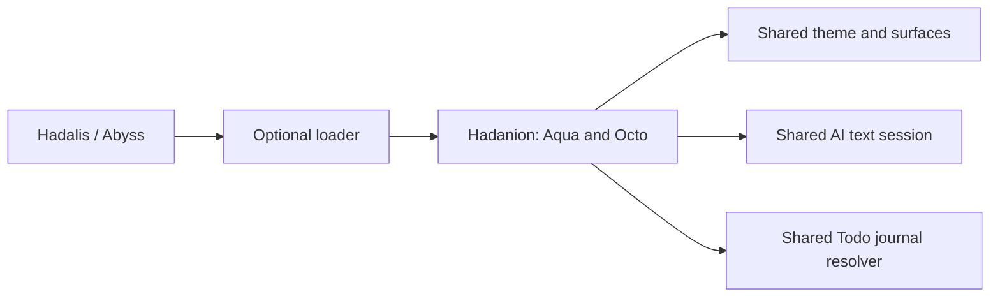

# Hadalis extraction and host API 1

Hadanion is an independently versioned optional feature package. It uses Hadalis as its desktop host; this first extraction does not create another popup system or a separate shell.

## Ownership

| Hadanion | Hadalis |
|---|---|
| Aqua/Octo Blender sources and sampled 3D motion curves | Existing Abyss screen edges, Dock, Sidebar, popup leases and water solver |
| Liquid renderer/shaders, faces, gaze, bubbles, 30 actions per character | Shared theme, rendering/power policy and compositor services |
| Presence, walking/running/flight, drag reactions, curiosity, cast turns | Finite discovery, session/output loaders and bounded presentation outputs |
| Companion talk/cloud UI, personality and Companion settings | General AI catalog, text transport, local GGUF discovery/supervisor |
| `inir-companiond` source/build and feature regressions | Core native helpers, package lifecycle and canonical maintainer validator |
| Companion context/chat/history helpers and active local AI plans | Todo/Obsidian helpers and existing preference schema |

The original import is pinned by [HADALIS_IMPORT.json](HADALIS_IMPORT.json), with source paths and original SHA-256 hashes. Native Rust protocol and binary name remain compatible. No runtime PNG/GIF sprites are introduced; Blender files stay in the authoring repository and outside the installed payload.

## API

`manifest.json` identifies `hadanion`, version, host API 1 and fixed session/output/settings/binary entrypoints. The installer adds exact source SHA and payload hashes. Hadalis validates the finite manifest and required files without starting a model or daemon.

`HadalisSession.qml` receives the host singleton and registered output adapters. It owns one behavior bridge, the selected character, visibility policy and chat reactions. It cancels chat/context work when unloaded. The host retains `wull chat/status` compatibility and exposes `hadanion refresh/status` for package discovery.

`HadalisOutput.qml` receives one `HadanionSurface` adapter per output. It reads the actual surface controller, painted field readiness/capacity, Bar layout, Sidebar/corner interfaces, owner modal/fullscreen state and existing wave functions. It exports separate input regions, explicit-chat focus, transient curiosity ownership, Dock hold and finite water contact/ripple uniforms. Only the selected output may present the actor. Portals, immersion and cloud overlays retain their original host stacking levels; the actor remains in its original position in the host's visual order.

The host loads product QML only when a compatible installed package is enabled in the Abyss family. Missing/incompatible packages expose no actor, input regions, focus lease or native child. Loader errors stop the optional session until explicit refresh. Existing popup lease acquire/release and user hand-off APIs remain the source of truth.

## Installation and compatibility

`make install` builds the locked Rust workspace, copies only the runtime payload to a release directory under the user's data home and atomically switches `current`. It never writes the Hadalis source/system package, downloads a model or changes enablement. Previous releases remain for rollback; uninstall removes only the owned current link.

The `abyss.companion` / `abyss.companionMind` keys, `wull` IPC target, Settings index 37 and `inir/wull/chat.sqlite3` transcript path remain compatible. No journal migration is needed. The explicit journal writer still consumes the host Todo daily-note resolver and retains byte-preserving write guards. GGUF inventory and supervision move to Hadalis `scripts/ai/` because the general AI tab also uses them.

## Validation boundaries

Hadanion's validator runs current product Rust/JavaScript behavior tests, owned QML/native lifecycle and visual fixtures, fake AI persistence/cancel/retry tests, atomic package lifecycle and product QML parsing. It stages a private host overlay; original source-path aliases exist only in that test overlay. This overlay is not a shipping dependency or a second implementation.

Imported historical diagnostic scripts remain available with their original source-pinned guards. They are not automatically dispatched by the current product validator. Do not replay consumed historical capture/benchmark lineages or treat old Hadalis receipts as Hadanion acceptance. Historical receipts stay in Hadalis unchanged.

Canonical Hadalis validation applies only to the exact Hadalis SHA printed by its run. Owned layer-shell/renderer fixtures are bounded integration evidence; physical multi-output/hotplug/suspend/focus/resource behavior and reference-image approval remain separate acceptance.

## Current local-model preference

Companion defaults to `abyss.companionMind.localOnly = true`; the typed preference/default is supplied by Hadalis `114c8d4fdbe054e3e262a939f6ee3a8095d7110b` or later. The optional settings page exposes **Allow cloud models**. Catalog ownership and model supervision remain in Hadalis; Hadanion only filters selection and guards the request boundary. Local HTTP text transport bypasses environment proxies. The existing GGUF path stays on the shared local supervisor.

## Current rendering preference

Three-level Companion quality requires Hadalis `361e81b7c95cc96c43a9314c103a7a997998d6f5` or later. Performance maps to persisted `performance` (tier 0), Balanced to existing `quality` (tier 1), and explicit Quality to `detailed` (tier 2). Historical `balanced` and unknown values still fall back to tier 1. Automatic power profiles retain tier 0 in Power Saver and tier 1 otherwise; the shared shell Performance ceiling always wins. Installing Hadanion preserves the user's existing quality/automatic preferences. Earlier hosts safely retain their old tier-1 ceiling; they do not activate the new detailed tier.
